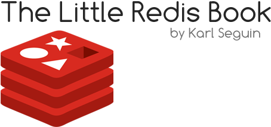

\thispagestyle{empty}
\changepage{}{}{}{-0.5cm}{}{2cm}{}{}{}
\

\clearpage
\changepage{}{}{}{0.5cm}{}{-2cm}{}{}{}

## 关于此书

### 许可证

《The Little Redis Book》是经由Attribution-NonCommercial 3.0 Unported license许可的，你不需要为此书付钱。

你可以自由地对此书进行复制，分发，修改或者展示等操作。当然，你必须知道且认可这本书的作者是Karl Seguin，译者是赖立维，而且不应该将此书用于商业用途。

关于这个**许可证**的*详细描述*在这里：

<http://creativecommons.org/licenses/by-nc/3.0/legalcode>

### 关于作者

作者Karl Seguin是一名在多项技术领域浸淫多年的开发者。他是开源软件计划的活跃贡献者，同时也是一名技术作者以及业余演讲者。他写过若干关于Radis的文章以及一些工具。在他的一个面向业余游戏开发者的免费服务里，Redis为其中的评级和统计功能提供了支持：[mogade.com](http://mogade.com/)。

Karl之前还写了《The Little MongoDB Book》(http://openmymind.net/2011/3/28/The-Little-MongoDB-Book/)，这是一本免费且受好评，关于MongoDB的书。

他的博客是<http://openmymind.net>，你也可以关注他的Twitter帐号，via [@karlseguin](http://twitter.com/karlseguin)。

### 关于译者

译者 赖立维 是一名长在天朝的普通程序员，对许多技术都有浓厚的兴趣，是开源软件的支持者，Emacs的轻度使用者。

虽然译者已经很认真地对待这次翻译，但是限于水平有限，肯定会有不少错漏，如果发现该书的翻译有什么需要修改，可以通过他的邮箱与他联系。他的邮箱是<jasonlai256@gmail.com>。

### 致谢

必须特别感谢[Perry Neal](https://twitter.com/perryneal)一直以来的指导，我的眼界、触觉以及激情都来源于你。你为我提供了无价的帮助，感谢你。

### 最新版本

此书的最新有效资源在：
<http://github.com/karlseguin/the-little-redis-book>

中文版是英文版的一个分支，最新的中文版本在：
<https://github.com/JasonLai256/the-little-redis-book>

\clearpage

## 简介

最近几年来，关于持久化和数据查询的相关技术，其需求已经增长到了让人惊讶的程度。可以断言，关系型数据库再也不是放之四海皆准。换一句话说，围绕数据的解决方案不可能再只有唯一一种。

对于我来说，在众多新出现的解决方案和工具里，最让人兴奋的，无疑是Redis。为什么？首先是因为其让人不可思议的容易学习，只需要简短的几个小时学习时间，就能对Redis有个大概的认识。还有，Redis在处理一组特定的问题集的同时能保持相当的通用性。更准确地说就是，Redis不会尝试去解决关于数据的所有事情。在你足够了解Redis后，事情就会变得越来越清晰，什么是可行的，什么是不应该由Redis来处理的。作为一名开发人员，如此的经验当是相当的美妙。

当你能仅使用Redis去构建一个完整系统时，我想大多数人将会发现，Redis能使得他们的许多数据方案变得更为通用，不论是一个传统的关系型数据库，一个面向文档的系统，或是其它更多的东西。这是一种用来实现某些特定特性的解决方法。就类似于一个索引引擎，你不会在Lucene上构建整个程序，但当你需要足够好的搜索，为什么不使用它呢？这对你和你的用户都有好处。当然，关于Redis和索引引擎之间相似性的讨论到此为止。

本书的目的是向读者传授掌握Redis所需要的基本知识。我们将会注重于学习Redis的5种数据结构，并研究各种数据建模方法。我们还会接触到一些主要的管理细节和调试技巧。

## 入门

每个人的学习方式都不一样，有的人喜欢亲自实践学习，有的喜欢观看教学视频，还有的喜欢通过阅读来学习。对于Redis，没有什么比亲自实践学习来得效果更好的了。Redis的安装非常简单。而且通过随之安装的一个简单的命令解析程序，就能处理我们想做的一切事情。让我们先花几分钟的时间把Redis安装到我们的机器上。

### Windows平台

Redis并没有官方支持Windows平台，但还是可供选择。你不会想在这里配置实际的生产环境，不过在我过往的开发经历里并没有感到有什么限制。

首先进入<https://github.com/dmajkic/redis/downloads>，然后下载最新的版本（应该会在列表的最上方）。

获取zip文件，然后根据你的系统架构，打开`64bit`或`32bit`文件夹。

### *nix和MacOSX平台

对于*nix和MacOSX平台的用户，从源文件来安装是你的最佳选择。通过最新的版本号来选择，有效地址于<http://redis.io/download>。在编写此书的时候，最新的版本是2.4.6，我们可以运行下面的命令来安装该版本：

	wget http://redis.googlecode.com/files/redis-2.4.6.tar.gz
	tar xzf redis-2.4.6.tar.gz
	cd redis-2.4.6
	make

（当然，Redis同样可以通过套件管理程序来安装。例如，使用Homebrew的MaxOSX用户可以只键入`brew install redis`即可。）

如果你是通过源文件来安装，二进制输出会被放置在`src`目录里。通过运行`cd src`可跳转到`src`目录。

### 运行和连接Redis

如果一切都工作正常，那Redis的二进制文件应该已经可以曼妙地跳跃于你的指尖之下。Redis只有少量的可执行文件，我们将着重于Redis的服务器和命令行界面（一个类DOS的客户端）。首先，让我们来运行服务器。在Windows平台，双击`redis-server`，在*nix/MacOSX平台则运行`./redis-server`.

如果你仔细看了启动信息，你会看到一个警告，指没能找到`redis.conf`文件。Redis将会采用内置的默认设置，这对于我们将要做的已经足够了。

然后，通过双击`redis-cli`（Windows平台）或者运行`./redis-cli`（*nix/MacOSX平台），启动Redis的控制台。控制台将会通过默认的端口（6379）来连接本地运行的服务器。

可以在命令行界面键入`info`命令来查看一切是不是都运行正常。你会很乐意看到这么一大组关键字-值（key-value）对的显示，这为我们查看服务器的状态提供了大量有效信息。

如果在上面的启动步骤里遇到什么问题，我建议你到[Redis的官方支持组](https://groups.google.com/forum/#!forum/redis-db)里获取帮助。

## 驱动Redis

很快你就会发现，Redis的API就如一组定义明确的函数那般容易理解。Redis具有让人难以置信的简单性，其操作过程也同样如此。这意味着，无论你是使用命令行程序，或是使用你喜欢的语言来驱动，整体的感觉都不会相差多少。因此，相对于命令行程序，如果你更愿意通过一种编程语言去驱动Redis，你不会感觉到有任何适应的问题。如果真想如此，可以到Redis的[客户端推荐页面](http://redis.io/clients)下载适合的Redis载体。

\clearpage
